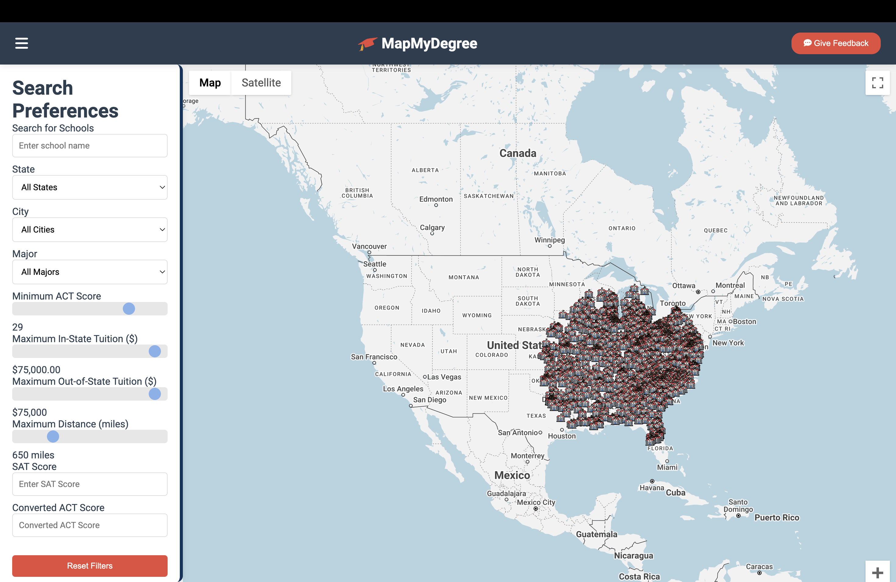

# MapMyDegree


## Overview

**MapMyDegree** is a dynamic web application designed to help students search and explore universities and colleges across the United States. With an intuitive interface and powerful search filters, users can find institutions that match their academic preferences, financial considerations, and geographic location. The integrated Google Maps feature provides a visual representation of search results, enhancing the user experience by allowing easy comparison of different schools.

## Features

- **Comprehensive Search Filters**: 
  - **School Name**: Search for specific schools by name.
  - **State & City**: Filter schools based on their geographic location.
  - **Major**: Select preferred majors to find schools offering those programs.
  - **ACT & SAT Scores**: Set minimum ACT scores or input SAT scores to match academic requirements.
  - **Tuition Costs**: Define maximum in-state and out-of-state tuition fees.
  - **Distance**: Specify the maximum distance from a chosen location.

- **Interactive Map**: 
  - Visualize search results on a Google Map.
  - Click on markers to view detailed information about each school.

- **Responsive Design**: 
  - Optimized for both desktop and mobile devices.
  - User-friendly interface with easy navigation.

- **Feedback System**: 
  - Provide feedback directly through the application.
  - Star rating and comment system to share user experiences.

## Screenshots

### School Search Dashboard



*The School Search Dashboard allows users to input their preferences and filters to find schools that best match their criteria.*

### Detailed View


*The Detailed View provides comprehensive information about a selected school, including location, tuition fees, available majors, and more.*

## Technologies Used

- **Frontend**:
  - HTML5, CSS3, JavaScript
  - Google Maps JavaScript API for interactive mapping
  - Font Awesome for icons
  - Responsive design principles for mobile compatibility

- **Libraries & Frameworks**:
  - [Google Fonts](https://fonts.google.com/) for typography
  - [Font Awesome](https://fontawesome.com/) for scalable vector icons

## Getting Started

### Prerequisites

- **Web Server**: To run the application locally, you can use any web server or simply open the `index.html` file in your browser.
- **Google Maps API Key**: Obtain an API key from the [Google Cloud Console](https://console.cloud.google.com/) and replace the placeholder in the HTML file.

### Installation

1. **Clone the Repository**

   ```bash
   git clone https://github.com/yourusername/MapMyDegree.git
